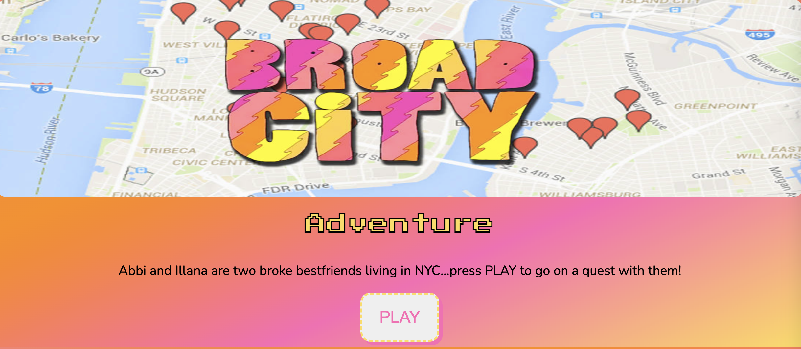

# :city_sunrise: _City Adventure_  :video_game:

>## :wavy_dash:LINK TO PLAY THE GAME:
>># **[City-Adventure](https://city-adventure.netlify.app/)**
>## :wavy_dash: ABOUT THE GAME
> ### I'm an avid fan of Illana Glazer and Abbi Jacobson - this choose-your-own-adventure style game is inspired by their show Broad City on Comedy Central.
>>Abbi and Illana are two broke bestfriends living in NYC. Abbi is a struggling artist with no health Insurance. She has a massive tooth-ache and needs her wisdom teeth removed. Using good judgment and widsom the player has to make decisons to help Abbi. 
>>#### These are the players options
> - Go to Central Park and people watch while you think about what do to   -> then go back and make a decision.
> - See Illana's partner who is a DENTIST, he can do the prodecure. 
> - Go see if Illana's Veterinarian friend will to the procedure...**risky**
>> After the prodecure you lose Abbi .. she is somewhere in NYC and you have to find her. 

> 

>## :wavy_dash: Technologies Used:
> - HTML5 and CSS
> - JavaScript ES6
> - Google Chrome Developer Tools
> - VSCode
> - StackOverflow, MDN, W3C

>## :wavy_dash: Next Steps (icebox-items):
> - Add Mini games 
> - Enhance CSS/Visuals
> - Improve Responsive Design
> - Mobile Device Usability

>## :wavy_dash: Planning Materials:
>**[Planning Materials](https://trello.com/b/vCgXyf9l/broad-city-choose-your-own-adventure-game)**

>## :wavy_dash: Credits/Attribution:
> - **[Heart favicon created by Freepik - Flaticon]("https://www.flaticon.com/free-icons/heart")**
> - Media - Comedy Central
> - **[Animation](https://animate.style/)**
> - **[Confetti](https://github.com/Agezao/confetti-js)**

